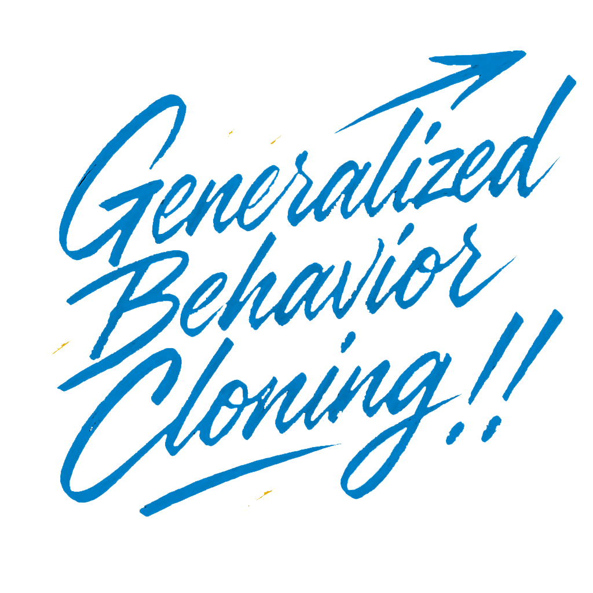
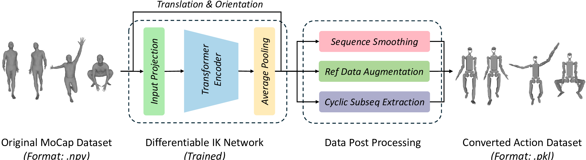
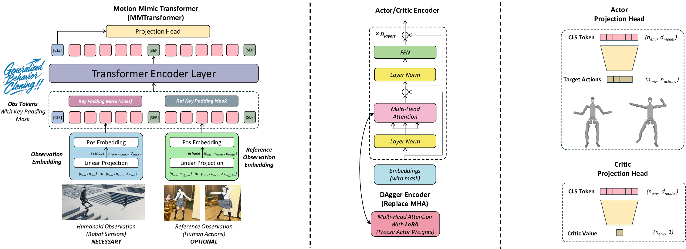
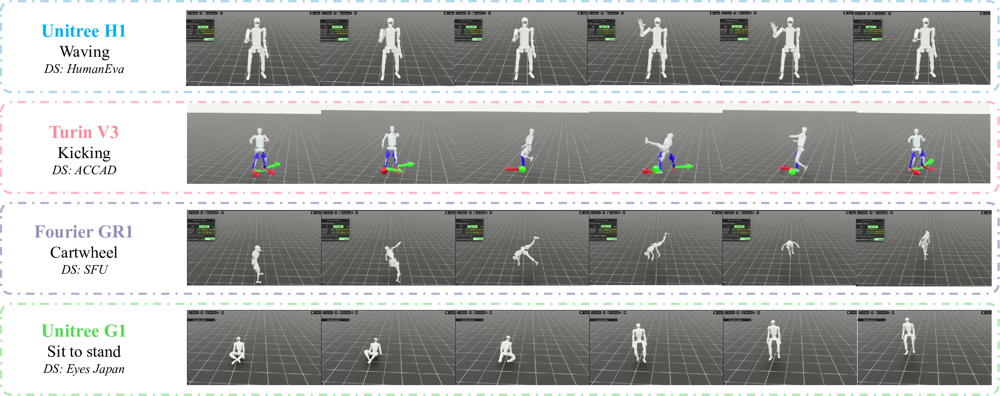
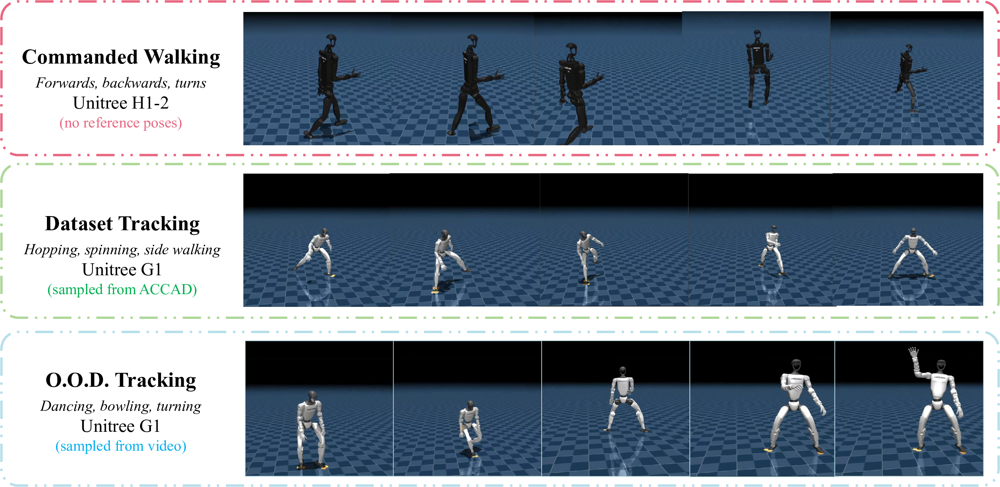

# GBC: Generalized Behavior-Cloning Framework for Whole-Body Humanoid Imitation

<div align="center">
  
</div>

<div align="center">

[](https://sjtu-mvasl-robotics.github.io/gbc/)
[](https://arxiv.org/abs/2508.09960)
[](https://www.python.org/downloads/release/python-3100/)
[](https://www.python.org/downloads/release/python-3110/)
[](https://pytorch.org/)
[](https://github.com/isaac-sim/IsaacLab)
[](https://github.com/isaac-sim/IsaacSim)
[](LICENSE)
<!-- [](resources/demo.mp4) -->

Yifei Yao<sup>1</sup>, Chengyuan Luo<sup>1,2</sup>, Jiaheng Du<sup>1</sup>, Wentao He<sup>1,3</sup>, Jun-Guo Lu<sup>1, *</sup>

<sup>1</sup> All authors are with Machine Vision and Autonomous System Laboratory, Shanghai Jiao Tong University, Shanghai, China.<br>
<sup>2</sup> Chengyuan Luo is with SJTU-Paris Elite Institute of Technology, Shanghai Jiao Tong University, Shanghai, China.<br>
<sup>3</sup> Wentao He is with the SJTU Global College, Shanghai Jiao Tong University, Shanghai, China.<br>
<sup>*</sup> Jun-Guo Lu is the corresponding author.
</div>

## Abstract

The creation of human-like humanoid robots is hindered by a fundamental fragmentation: data processing and learning algorithms are rarely universal across different robot morphologies. This paper introduces the Generalized Behavior Cloning (GBC) framework, a comprehensive and unified solution designed to solve this end-to-end challenge. GBC establishes a complete pathway from human motion to robot action through three synergistic innovations:

1. An adaptive data pipeline leverages a differentiable IK network to automatically retarget any human MoCap data to any humanoid.
  
2. Our novel DAgger-MMPPO algorithm with its MMTransformer architecture learns robust, high-fidelity imitation policies.
  
3. The entire framework is delivered as an efficient, open-source platform based on Isaac Lab, empowering the community to deploy the full workflow via simple configuration scripts.

We validate the power and generality of GBC by training policies on multiple heterogeneous humanoids, demonstrating excellent performance and transfer to novel motions. This work establishes the first practical and unified pathway for creating truly generalized humanoid controllers.

## Introduction
This repository is the official implementation of [GBC: Generalized Behavior Cloning for Whole-Body Humanoid Imitation](https://arxiv.org/abs/2508.09960).

## Release Roadmap

<table>
<tr>
  <th>Component</th>
  <th>Status</th>
  <th>Description</th>
</tr>
<tr>
  <td>Retargeting Pipeline</td>
  <td>✅ Released</td>
  <td>Complete framework for retargeting human motion capture data to any humanoid robot morphology</td>
</tr>
<tr>
  <td>RL+IL Repository</td>
  <td>✅ Released</td>
  <td>Core reinforcement learning and imitation learning algorithms used in GBC</td>
</tr>
<tr>
  <td>Reinforcement Learning Library</td>
  <td>✅ Released</td>
  <td>Associated RL algorithm library with implementations of PPO, MMPPO, and custom extensions</td>
</tr>
<tr>
  <td>Documentation & Tutorials</td>
  <td>✅ Released</td>
  <td>Basic usage documentation and getting-started tutorials</td>
</tr>
<tr>
  <td>Robot-Specific Training Demos</td>
  <td>✅ Released</td>
  <td>Demonstration examples for specific robot configurations</td>
</tr>
<tr>
  <td>Training Scripts for All Test Robots</td>
  <td>⏳ Coming Soon</td>
  <td>Complete training scripts for all robots evaluated in the paper</td>
</tr>
<tr>
  <td>Demo Videos</td>
  <td>🔜 Imminent</td>
  <td>Comprehensive demonstration videos of the framework in action</td>
</tr>
<tr>
  <td>Hugging Face Checkpoints</td>
  <td>🔜 Imminent</td>
  <td>Pre-trained model checkpoints available on Hugging Face</td>
</tr>
<tr>
  <td>Tutorial Videos</td>
  <td>⏳ Planned</td>
  <td>Step-by-step video tutorials for using the GBC framework</td>
</tr>
<tr>
  <td>Advanced Features Documentation</td>
  <td>⏳ Planned</td>
  <td>Detailed tutorials for advanced features (AMP, DAgger, Symmetry Augmentation, etc.)</td>
</tr>
<tr>
  <td>MuJoCo Sim2Sim Validation</td>
  <td>⏳ Planned</td>
  <td>Scripts for validating sim-to-sim transfer using MuJoCo</td>
</tr>
<tr>
  <td>Deployment Code</td>
  <td>⏳ Planned</td>
  <td>Deployment code for currently available robot configurations</td>
</tr>
</table>

## Important Announcements 📢

### 🤖 Collaboration Opportunity

We are actively seeking to test and validate our algorithms on additional humanoid robot platforms. If you are a researcher or industry partner working with humanoid robots and are interested in collaboration, we'd love to discuss potential partnerships. Our framework is designed to be adaptable to various morphologies, and we're excited to expand our testing across diverse platforms.

### 🔄 Compatibility Notice

The current codebase is largely compatible with `Isaac Lab 2.2.0` and `Isaac Sim 5.0` (the latest release). However, some interfaces may still require minor adjustments. We are working to release a fully updated version soon. If you encounter any issues with the current version, please submit an issue or contact the authors directly.

### 📝 Response Time Notice

⚠️ The main author of this work is currently in the process of PhD applications and job searching. As a result, responses to issues may be delayed. We appreciate your understanding and patience during this time.

### 🛠️ Community Contributions

💡 We warmly welcome community feedback, suggestions, and improvements to the algorithm and its implementation! Pull requests are greatly appreciated, though please note that review and acceptance may be delayed for the reasons mentioned above. Your contributions are valuable to the continued development of this project.

## Quick Overview

### 1. Retargeting & Data Processing Pipeline

Our framework provides a fast, adaptive system for your humanoid robot configuration, delivering real-time, efficient, and physically feasible kinematic retargeting with comprehensive data post-processing.

<div align="center">
  
</div>

### 2. Advanced Network Architecture & Enhanced PPO Algorithm

We employ the MMTransformer to seamlessly integrate the robot's environment observations with reference actions. Through our MMPPO framework, we enable single-action to multi-action imitation, allowing your robot to switch freely between action tracking and reinforcement learning instruction following modes.

<div align="center">
  
</div>

### 3. Cross-Platform Testing and Validation

Train your policies in Isaac Sim, validate playback, and verify policy transfer in MuJoCo for comprehensive evaluation (evaluation code will be released soon).

<div align="center">
  
  
</div>

## Getting Started

For detailed instructions, we highly recommend reading our [comprehensive documentation](https://sjtu-mvasl-robotics.github.io/gbc/docs/category/installation).

### Prerequisites

Before starting, ensure you have all the necessary [prerequisites](https://sjtu-mvasl-robotics.github.io/gbc/docs/Installation/pre-requisites) installed on your system. This includes Python, CUDA, Isaac Lab/Sim (optional), and appropriate hardware.

### Installation

1. **Set up your environment**
   ```bash
   # Create and activate conda environment
   conda create -n GBC python=3.10
   conda activate GBC
   ```

2. **Install GBC and dependencies**
   ```bash
   # Create and navigate to GBC directory
   mkdir GBC && cd GBC

   # Clone GBC repository with all submodules
   git clone https://github.com/sjtu-mvasl-robotics/GBC.git --recursive
   cd GBC
   
   # If you have Isaac Lab installed, remove its auto-installed rsl_rl first
   pip uninstall rsl_rl
   
   # Install GBC and its dependencies
   pip install -e .
   cd dependencies/rsl_rl
   pip install -e .
   ```

3. **Verify installation**
   ```bash
   python verify_installation.py
   ```
   
   Successful installation should show:
   ```
   ✅ GBC Core: OK
   ✅ SMPL Support: OK
   ✅ Isaac Lab: OK (if installed)
   ✅ rsl_rl: OK (if installed, and has dev tag)
   ```

### Workflow

1. **Prepare datasets**
   
   Set up your data paths and download necessary datasets by following our [data preparation guide](https://sjtu-mvasl-robotics.github.io/gbc/docs/Installation/prepare-data-path).

2. **Train retargeting network**
   
   Create a retargeting network for your robot by following the [data preparation tutorials](https://sjtu-mvasl-robotics.github.io/gbc/docs/category/data-preparation).

3. **Train reinforcement learning policy**
   
   Train your GBC policy using the [GBC training tutorials](https://sjtu-mvasl-robotics.github.io/gbc/docs/category/gbc-training).

4. **Deploy and validate**
   
   Deploy your trained model and validate performance using our [deployment guides](https://sjtu-mvasl-robotics.github.io/gbc/docs/category/deployment).


## Device Requirements
Our RL+IL experiments are conducted mostly on a single `NVIDIA GeForce RTX 4090D 24G`, some further experiments and ablation are ran on `NVIDIA GeForce RTX 5090D 32G`. For RL+IL tasks, we recommend devices with at least 24G GPU capacity.

For GBC core (retargeting pipeline), we ran test on a single `NVIDIA GeForce RTX 3070ti 8G`, this is enough memory for the retargeting and data post processing part.

## License

GBC is released under the [Apache License 2.0](LICENSE).

### Dependencies

This project relies on several open-source libraries, each with its own license:

- **Core Dependencies**:
  - PyTorch ([BSD License](licenses/LICENSE_pytorch))
  - NumPy ([BSD License](licenses/LICENSE_numpy))
  - SciPy ([BSD License](licenses/LICENSE_scipy))
  - rsl_rl ([MIT License](licenses/LICENSE_rsl-rl))

- **Visualization and Rendering**:
  - OpenCV ([BSD License](licenses/LICENSE_opencv))
  - Matplotlib (PSF-based License)
  - Pyrender ([MIT License](licenses/LICENSE_pyrender))
  - Open3D ([MIT License](licenses/LICENSE_open3d))
  - Pillow ([HPND License](licenses/LICENSE_pillow))

- **Simulation Frameworks**:
  - Isaac Lab ([License](licenses/LICENSE_isaaclab))
  - PyTorch Kinematics ([MIT License](licenses/LICENSE_pytorch_kinematics))

- **Data Processing**:
  - NetworkX ([BSD License](licenses/LICENSE_networkx))
  - ONNX ([MIT License](licenses/LICENSE_onnx))

Please see the [licenses](licenses/) directory for the full license text of each dependency.

## Contact Us

If you have any questions or feedback, please feel free to reach out to us!

Mail of the 1st author: [mailto:Yifei Yao](mailto:godchaser@sjtu.edu.cn)
Mail of the corresponding author: [mailto:Jun-Guo Lu](mailto:jglu@sjtu.edu.cn)

If you want to contact our laboratory for more information, it is recommended to reach out to the corresponding author. For technical inquiries, please contact the 1st author.

## Citation

If you find GBC useful in your research, please consider citing our paper:

```bibtex
@misc{yao2025gbcgeneralizedbehaviorcloningframework,
      title={GBC: Generalized Behavior-Cloning Framework for Whole-Body Humanoid Imitation}, 
      author={Yifei Yao and Chengyuan Luo and Jiaheng Du and Wentao He and Jun-Guo Lu},
      year={2025},
      eprint={2508.09960},
      archivePrefix={arXiv},
      primaryClass={cs.RO},
      url={https://arxiv.org/abs/2508.09960}, 
}
```

